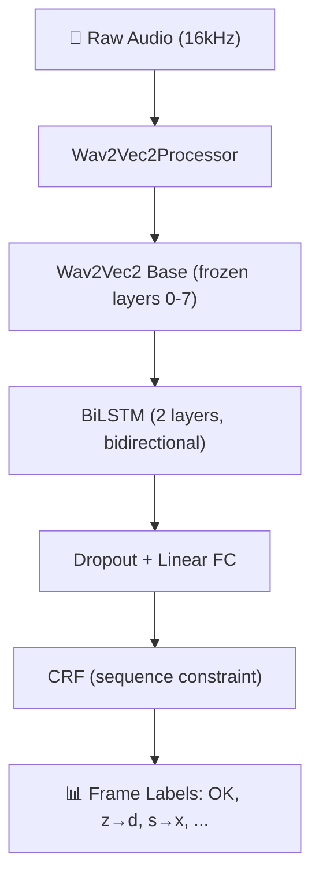

# 🎯 Wav2Vec2 + BiLSTM + CRF — Pronunciation Error Detection

## Architecture



## Project Structure

```
fine-tune-2/
├── requirements.txt
├── tools/                            ← Data preparation pipeline
│   ├── 01_prepare_audio.py           ← Extract & resample audio to 16kHz
│   ├── 02_run_mfa.py                 ← Montreal Forced Aligner (phoneme alignment)
│   └── 03_textgrid_to_dataset.py     ← Convert MFA output → dataset.json
├── data/
│   ├── raw/                          ← Your video/audio files (input)
│   ├── audio/                        ← Extracted 16kHz WAV files
│   ├── transcript/                   ← Text transcripts (.txt)
│   ├── aligned/                      ← MFA TextGrid output
│   └── final/
│       ├── dataset.json              ← Your labeled dataset
│       └── dataset_sample.json       ← Sample format reference
└── models/
    ├── __init__.py
    ├── wav2vec2_crf.py               ← Model (Wav2Vec2 + BiLSTM + CRF)
    ├── baseline_model.py             ← Baseline (MFCC + BiLSTM) for comparison
    ├── audio_dataset.py              ← Dataset + collate
    ├── utils.py                      ← Label vocab + frame label builder
    ├── train.py                      ← Two-phase production training
    ├── evaluate.py                   ← Evaluation metrics (P/R/F1)
    └── predict.py                    ← Inference script
```

## Key Optimizations Applied

| Issue | Fix Applied |
|---|---|
| ❌ wav2vec2 forward called **twice** per batch | ✅ Extract features once, use `forward_from_features()` |
| ❌ Per-sample loop in training | ✅ Batch CRF — no loop for forward/loss |
| ❌ No mixed precision | ✅ AMP (`torch.amp.autocast`) → ~40% faster |
| ❌ Random freeze | ✅ Smart freeze: layers 0-7 frozen, 8-11 trainable |
| ❌ Fixed learning rate | ✅ Linear warmup scheduler |
| ❌ No gradient accumulation | ✅ `ACCUM_STEPS=2` → effective batch = 8 |
| ❌ Audio-level mask for CRF | ✅ Frame-level mask with padding awareness |
| ❌ No checkpoint/resume | ✅ Full checkpoint save & resume |
| ❌ No validation | ✅ Train/val split + best model tracking |
| ❌ Single-phase training | ✅ Two-phase: freeze→classifier, then full fine-tune |
| ❌ No evaluation metrics | ✅ Per-class P/R/F1 + error detection accuracy |
| ❌ No baseline comparison | ✅ MFCC+BiLSTM baseline model |
| ❌ No data pipeline | ✅ Full tools: audio extract → MFA → dataset.json |
| ❌ No phoneme-level predict | ✅ Majority voting frame→phoneme aggregation |

## How to Run

### 1. Install dependencies
```bash
pip install -r requirements.txt
```

### 2. Prepare data (Full Pipeline)

#### Step 1: Place raw files
```
data/raw/sample.mp4          ← your video/audio
data/transcript/sample.txt   ← matching transcript text
```

#### Step 2: Extract audio
```bash
python tools/01_prepare_audio.py
```

#### Step 3: Run MFA alignment
```bash
python tools/02_run_mfa.py
```

#### Step 4: Generate dataset.json
```bash
python tools/03_textgrid_to_dataset.py
```

#### Step 5: Label errors manually
Open `data/final/dataset.json` and change `"OK"` to error labels for mispronounced phonemes.

### 3. Train (Two-Phase)
```bash
cd models
python train.py
```

### 4. Evaluate
```bash
cd models
python evaluate.py --checkpoint checkpoints/best_model.pt
```

### 5. Predict
```bash
cd models
python predict.py --audio path/to/test.wav
python predict.py --audio path/to/test.wav --phonemes phonemes.json --output results.json
```

## Training Strategy

### Phase 1: Classifier Training (5 epochs)
- Wav2Vec2 layers 0-7 **frozen**
- Only LSTM + FC + CRF are trained
- Higher learning rate (1e-3)
- Fast convergence for classification head

### Phase 2: Full Fine-Tuning (10 epochs)
- **All layers unfrozen**
- Lower learning rate (1e-5) to preserve pretrained features
- End-to-end optimization
- Best model saved by validation loss

## ⚠️ Critical Notes

> [!CAUTION]
> **`build_frame_labels` must be accurate!** Wrong phoneme-to-frame alignment = model learns garbage.

> [!WARNING]
> **CRF is very sensitive to mask.** Frame mask must be padding-aware and match emissions shape exactly.

> [!IMPORTANT]
> **Label imbalance:** Most frames will be "OK". Consider adding `WeightedRandomSampler` if error detection accuracy is poor.

## Next Steps

1. **Prepare your real dataset** with audio + MFA phoneme alignments
2. **Customize labels** in `models/utils.py` → `DEFAULT_LABELS`
3. **Train** and monitor train vs val loss convergence
4. **Evaluate** per-class F1 scores
5. **Optional upgrades:**
   - `WeightedRandomSampler` for class imbalance
   - Feature caching (freeze wav2vec2, cache outputs → 5-10x speedup)
   - Multi-task: predict phoneme identity + error type simultaneously
